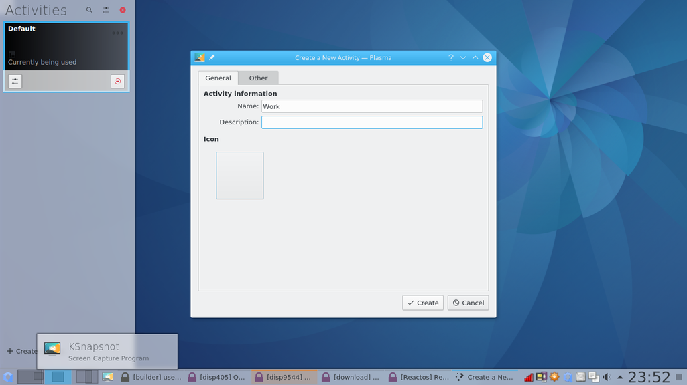

# KDE in Qubes 4.1
KDE can be installed very simply:  
`sudo qubes-dom0-update kde-settings-qubes`

You may also wish to install `sddm` for a better log in experience.

Log out: you can then choose Plasma from the drop down menu and log in.

## Virtual Desktops
The system starts with a single desktop.  
You can add more desktops by Right Clicking on the desktop icon and selecting "Add Virtual desktop".  

If you do not see the icon, right click on the Panel, and select "Edit Panel" - the desktop pager will then be available.  
Or you can open "System Settings" -> ""Workspace Behaviour" -> "Virtual Desktops"


You can move windows between desktops by dragging the outlines on the desktop pager.  
KDE has excellent support for keyboard shortcuts - You can move between desktops, and move windows between desktops, using the keyboard.
The default shortcuts are `Ctrl+F1` to switch to desktop 1....  , and you can add custom shortcuts for other actions.

If you have many windows open for the same qube,
KDE will nest them under a single button - if you hover over, you will see a thumbnail.
You can click this to jump to the window.

If you click, a list of the windows.  


All of this is fairly standard stuff.
You can Alt+Tab to get a list of open windows, and cycle through them.


And you can filter this to apply to only the current desktop, or all desktops.
Again, pretty standard.
You can hit the top left corner of the screen to see thumbnails of all open windows, or `Ctrl+<F9>` - then you can jump to the window you want.

## Taming the menu
Xfce has a horrible menu system.
Even a simple Qubes install has a menu that is overblown and difficult to work with.  

KDE has a number of different menu widgets - a full screen dashboard, a launcher

, or a more traditional menu.

The Left Hand side contains Favourites - the top icon is for KDE settings, useful for setting custom keyboard shortcuts and window controls.

To be able to edit the KDE menu, edit the file:  
`/etc/X11/xinit/xinitrc.d/55xfce-qubes.sh`, so that it
looks like this:  
```
#!/usr/bin/sh

# Use Qubes provided menu instead of default XFCE one
if [ "$XDG_SESSION_DESKTOP" = "KDE" ] ||  [ "$XDG_SESSION_DESKTOP" = "plasma" ]; then
  XDG_MENU_PREFIX="kf5-"
else
  XDG_MENU_PREFIX="qubes-"
fi

export XDG_MENU_PREFIX
```


KDE has a menu editor - Right click on the Menu Icon and select "Edit Applications".

You can create sub-menus, and move items by drag and drop.


You can customise the menu as much as you like.
Perhaps grouping qubes together, and creating a submenu for Templates.

Or even putting the emphasis on applications:

Or simplified further:

Notice that here some of the applications are listed without any reference to the qubes that provide them.

You can also customise Favourites - Right click on any entry, and select "Add to Favourites"


Of course, you can also add short cuts to the desktop. Just Right click on any entry, and select "Add to Desktop"

## Activities
So KDE provides a decent menu system, virtual desktops, simple tools to organise and find windows, and excellent keyboard controls over all aspects of windows.  
But it's Activities that really make it ideal for Qubes use.

What are activities? You can think of them as a way of separating each desktop in to an independent workspace.  
What that means in practice is that you can create activities, each with their own wallpaper, widgets and shortcuts.  
Here is a "personal" activity:  

Here is the "work" activity:  


This really helps in Qubes in ensuring that related windows are grouped together, minimising the risk of transferring data between the wrong qubes.
You can use the Qubes colours to identify each activity.

There is an "Activity" switcher, like the desktop switcher, and you can move windows between activities.
You can also set keyboard shortcuts to move between activities, or cycle between them: `Meta+Tab` to cycle activities, like `Alt+Tab` cycles windows.

You can open the Activity Manager from the Right-Click Menu on the desktop, or add an "Activity" widget - RightClick->"Add widgets"->Actvity and drag the icon where you want it on the desktop or the panel.  
You can create Activities from the Manager:





You can force windows from specific qubes to appear in a specific Activity.
Do this by Right Clicking on the title bar, More Actions ->Special Window Settings.  

On the "Window matching" Pane, substring match to the name of the qube.  

On the "Size and Position", Select Activity, and Force to the Activity you want.  

Now every window from that qube will only appear in the activity you selected.
You can also control where windows will appear on the screen, at what size.

If you are using Activities, you can tune your shortcuts a little.
Each activity has its own UUID - you can see this:  
`qdbus org.kde.ActivityManager /ActivityManager/Activities  CurrentActivity`
e.g `5a97605e-fcbc-4c6d-ad1c-232a0463baf5`

Create a file in dom0:
```
#!/bin/sh
qdbus org.kde.ActivityManager /ActivityManager/Activities  SetCurrentActivity 5a97605e-fcbc-4c6d-ad1c-232a0463baf5
qvm-run work libreoffice &
```
And link it to a shortcut - now the shortcut will switch you to the Work Activity and open libreoffice.


