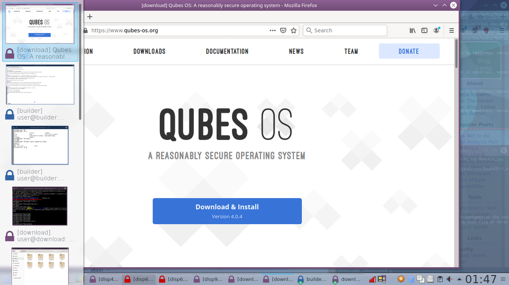
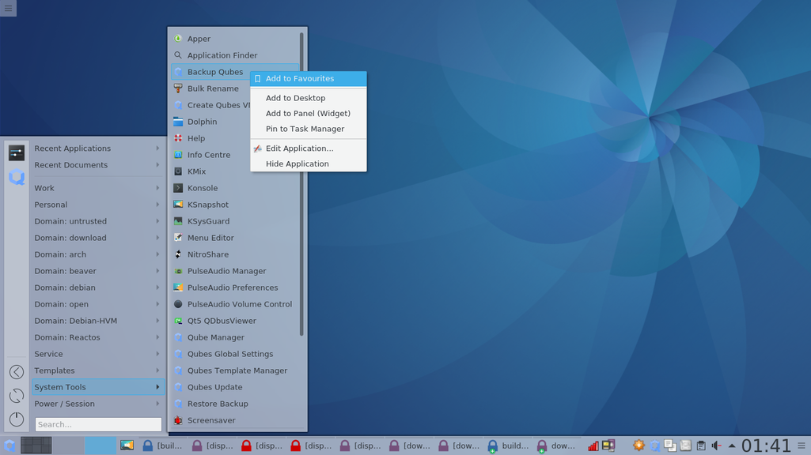

# KDE in Qubes
KDE can be installed very simply:  
`sudo qubes-dom0-update @kde-desktop-qubes`

Log out, you can then choose Plasma and log in.

## Virtual Desktops
The system starts with a single desktop.  
You can add more desktops by Right Clicking on the desktop icon and selecting "Add Virtual desktop".  

You can move windows between desktops by dragging the outlines on the desktop icon.  
KDE has excellent support for keyboard shortcuts - You can move between desktops, and move windows between desktops, using the keyboard.
The default shortcuts are `Ctrl+F1` to switch to desktop 1....  , and you can add custom shortcuts for other actions.

If you have many windows open for the same qube, KDE will nest them under a single button.
kde1 - if you hover over, you will see a thumbnail.  

If you click, a list of the windows.  

All of this is fairly standard stuff.
You can Alt+Tab to get a list of open windows, and cycle through them.

And you can filter this to apply to only the current desktop, or all desktops.
Again, pretty standard.
You can hit the top left corner of the screen to see thumbnails of all open windows, or `Ctrl+<F9>` - then you can jump to the window you want.

## Taming the menu
Xfce has a horrible menu system.
Even a simple Qubes install has a menu that is overblown and difficult to work with.  

KDE has a number of different menu widgets - a full screen dashboard, a launcher

, or a more traditional menu.

The LeftHand side contains Favourites - the top icon is for KDE settings, useful for setting custom keyboard shortcuts and window controls.

KDE has a menu editor - Right click on the Menu Icon and select "Edit Applications".

You can create sub-menus, and move items by drag and drop.

You can customise the menu as much as you like.
Perhaps grouping qubes together, and creating a submenu for Templates.

Or even putting the emphasis on applications:

Or simplified further:

Notice that here some of the applications are listed without any reference to the qubes that provide them.

You can also customise Favourites - Right click on any entry, and select "Add to Favourites"

Of course, you can also add short cuts to the desktop. Just Right click on any entry, and select "Add to Desktop"

